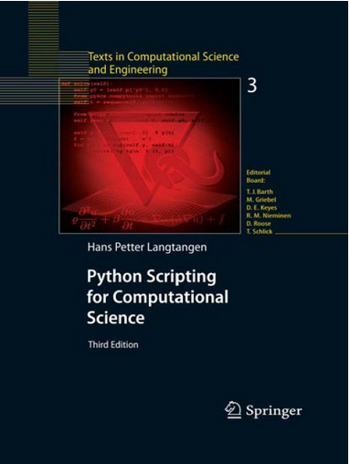

# Introduction to f2py

## Olav Vahtras

Leiden 2015-04-14

---

layout: false

## Learning goals

* Convert Fortran functions and subroutines to Python modules

* Conversion between NumPy and Fortran arrays

---

## Interfacing Python with Fortran: `f2py`

* Maybe the easiest compiled langue for interfacing

* Distributed with the `numpy` package

* Minimal modifications in original Fortran source

* Gives you modules that can be imported in Python

---

## When to consider f2py

* Python is too slow

* Algorithm prevents vectorization


## Example 1 (daxpy)
```python
for i in range(n):
    y[i] = y[i] + a * x[i]
```


## Example 2 (recursion)
```
for i in range(n):
    y[i+1] = a*y[i] + b*y[i-1]
```

---

### Invocation

```bash
$ f2py -c -m module_name source.f90
```
generates a dynamically linked library `module_name.so`
which can be imported in Python with

```python
import module_name
```
--

*Tip:* a quick test that a module exists is

```bash
$ python -c 'import module_name'
```

---

### Fortran functions

* In simple cases you can use Fortran files directly
* `f2py` converts the Fortran function to a Python function

```fortran 
!source.f90
double precision function fun(x)
double precision x
...
end function
```
--

* Compile

```bash
$ f2py -c -m module_name source.f90
```
--
* Use

```python
import module_name
result = module_name.fun(3.14)
```

---

### Fortran subroutines

To think about:

* In Fortran subroutines input and output arguments can be in any order
* In Python functions arguments are input, return values are output
* Supply directives

--

Fixed format:
```fortran
       subroutine sub(y, x)
       double precision y, x
Cf2py intent(in) x
Cf2py intent(out) y
...
```
--

Free format:
```fortran
subroutine sub(y, x)
double precision y, x
!f2py intent(in) x
!f2py intent(out) y
...
```
--
Note that also this is transformed to a function of one argument 
```python
result = module_name.sub(3.14)
```
---

### Fortran and numpy arrays

* Extending the subroutine for numpy array arguments
* The length `n` must be in the subroutine definition, but not in Python

```fortran
subroutine vectorized_sub(y, x, n)
double precision y(n), x(n)
!f2py intent(in) x
!f2py intent(out) y
integer n
integer i
...
do i=1, n
    y(i) = f(x(i))
end do
end
```
--

* It can now be called in Python with numpy arrays

```
x_vec = numpy.zeros(10)
y_vec = my_module.vectorized_sub(x_vec)
```
--
*Note:* the intent(out) makes the function allocate the return array

---


### Using in/out intent arguments

* In applications that update an existing array
* Avoid memory leaks

```fortran
subroutine vectorized_sub_update(y, x, n)
double precision y(n), x(n)
integer n
!f2py intent(in) x
!f2py intent(in, out) y
integer i
...
do i=1, n
    y(i) = y(i) + f(x(i))
end do
end
```
--

* Now two vector input arguments

```python
y_vec = mymod.vectorized_sub_update(y_vec, x_vec)
```
---

### An explicit example

```fortran
double precision function  mycos(x)
double precision x
mycos = cos(x)
end

subroutine cos_sub(cos_x, x)
double precision cos_x, x
!f2py intent(out) cos_x
cos_x = cos(x)
end

subroutine vectorized_cos_sub(cos_x, x, n)
double precision cos_x(n), x(n)
!f2py intent(out) cos_x
!f2py intent(in) x
integer i
do i=1, n
    cos_x(i) = cos(x(i))
end do
end

subroutine vectorized_sub_update(y, x, n)
double precision y(n), x(n)
integer n
!f2py intent(in) x
!f2py intent(in, out) y
integer i
do i=1, n
    y(i) = y(i) + cos(x(i))
end do
end
```
---

## Final remarks

* Easy to generate compiled Python modules from Fortran

* Easy to handle both scalar and vector (array) arguments

* However, always profile first - is it worth it?


## Links

* http://docs.scipy.org/doc/numpy-dev/f2py/ 
* Python Scripting for Computational Science (Langtangen)




